# sd-webui-pixelart
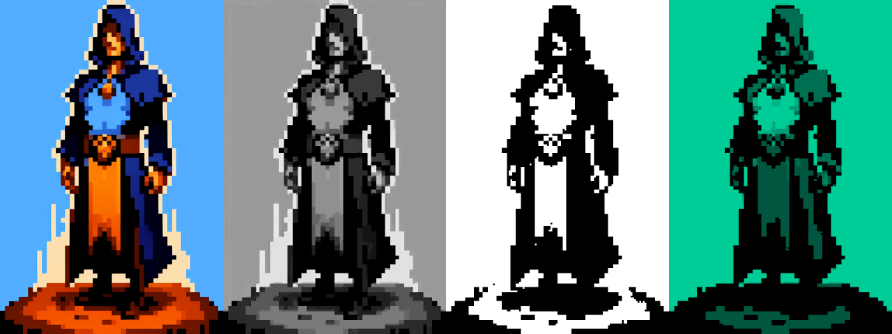
Extension for [Automatic1111 webui](https://github.com/AUTOMATIC1111/stable-diffusion-webui) that pixelize images.

## Installation
1. Go to "Extensions" tab
2. Switch to "Install from url"
3. Paste `https://github.com/mrreplicart/sd-webui-pixelart` to the "URL for extension's git repository" field and click "Install" button
4. After installation is complete, go to "Installed" tab and click "Apply and restart UI"

## Usage
This extension can be found both in txt2img/img2img and extras.
If you would like to process image right after generation you can use "Pixel art" script in txt2img/img2img. Or you can click "Send to extras" button and play with settings and process your images in extras tab.

Check "Enable" in script section and also check "Enable" for exact tab (color, grayscale, black and white or custom palette)  
**Downscale** - image downscale factor, for example 512x512 image with downscale set to 2 become 256x256.  
**Rescale to original size** - rescales image back to original size after downscale and color correction.  

### Color
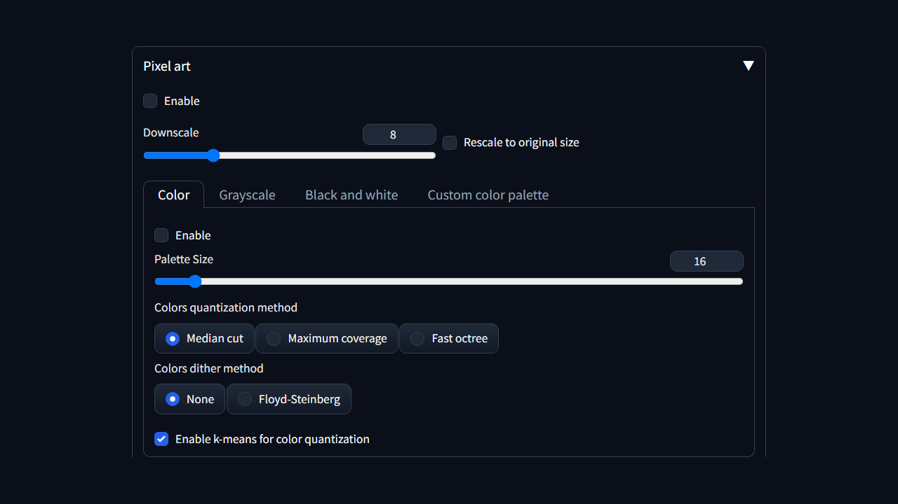

**Palette Size** - number of colors

  
Palette size examples

  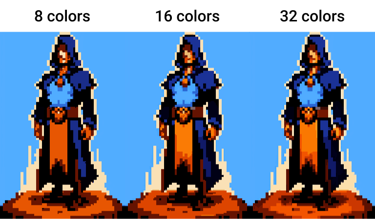
  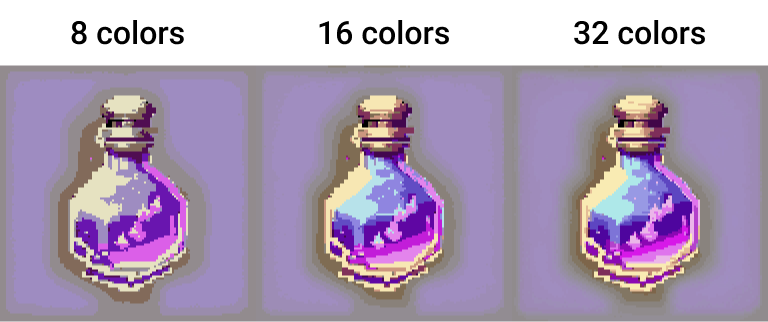
  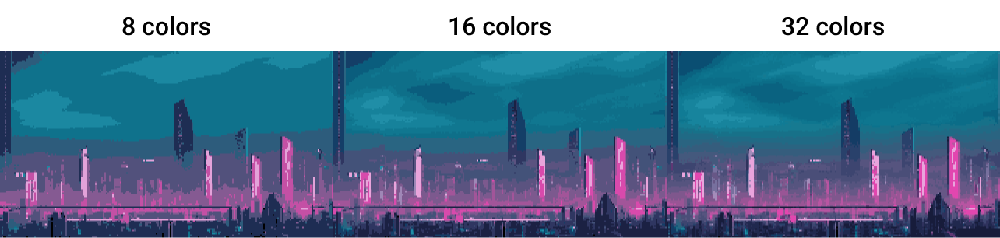

**Colors quantization method** - different algorithms to get colors from image

  
Quantization examples

  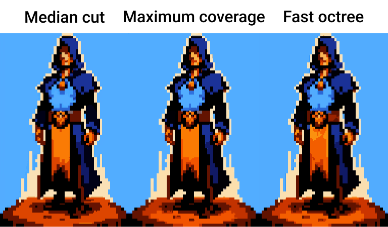
  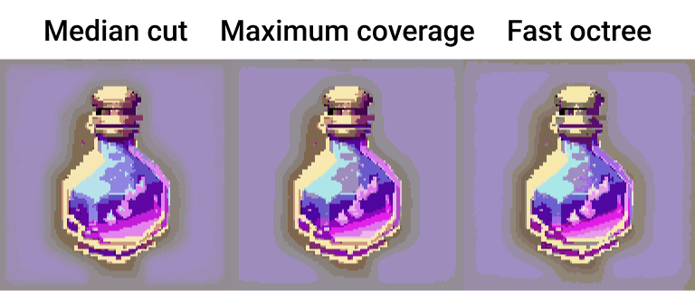
  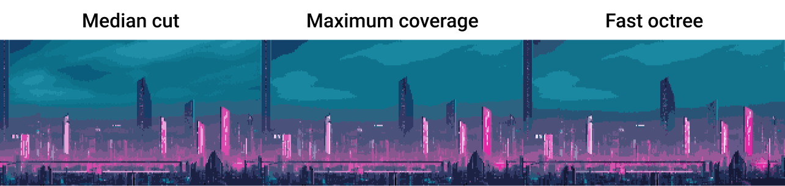

**Colors dither method** - different methods to represent colors with limited color palette

  
Dither examples

  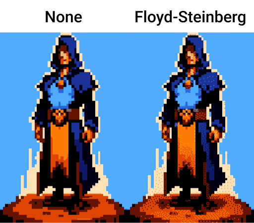
  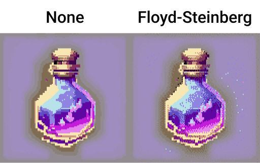
  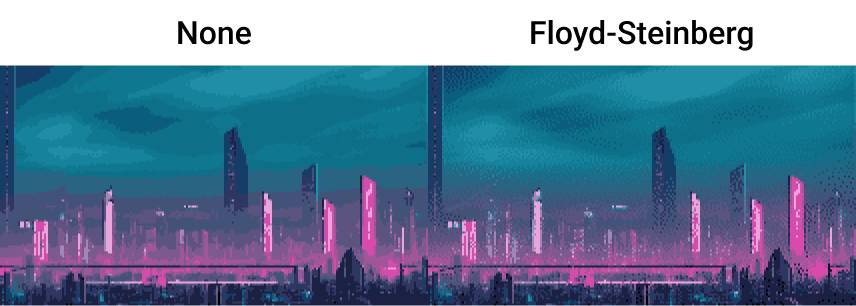

**Enable k-means for color quantization** - in most cases picks better colors

  
K-means examples

  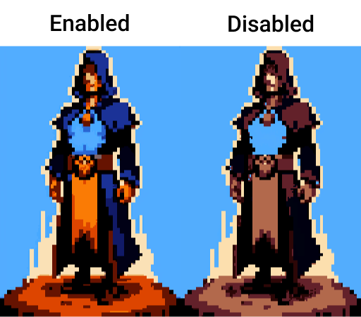
  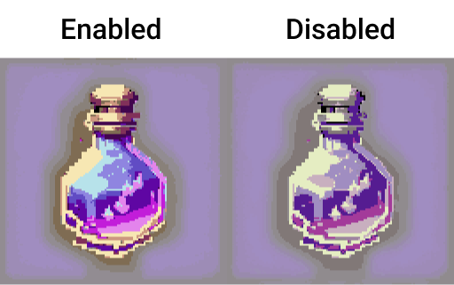
  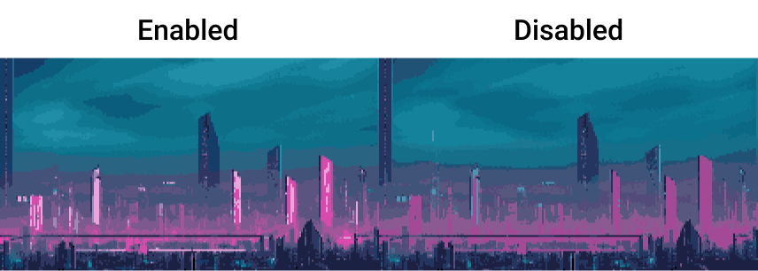

### Grayscale
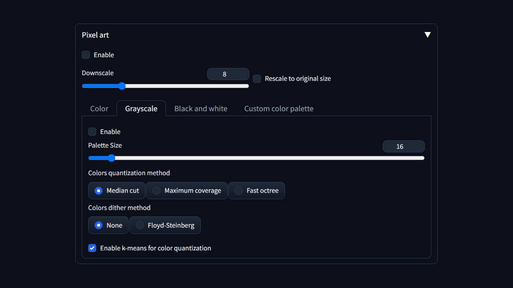
Same as color tab, but instead of colors we work with shades of gray

  
Grayscale examples

  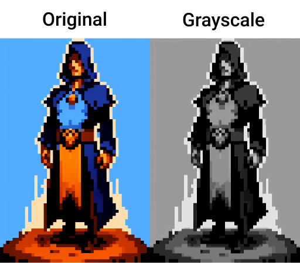
  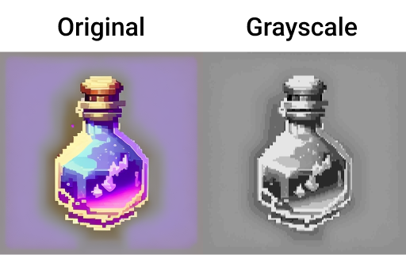
  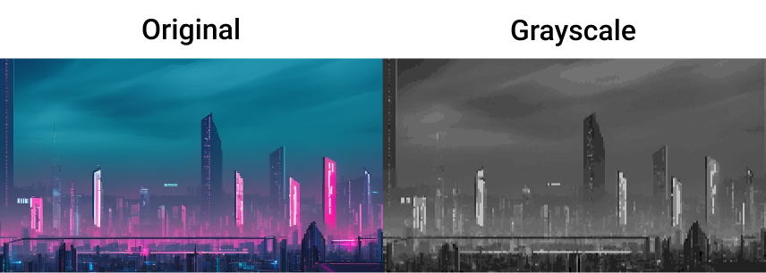

### Black and white
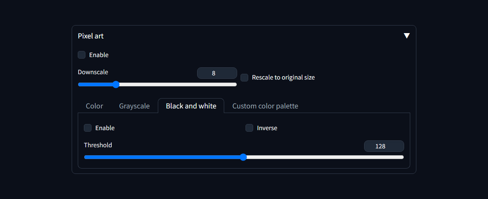
Simple black and white mode

**Threshold** - value that determens when we paint pixel black or white
**Inverse** - inverse colors

  
Black and white

  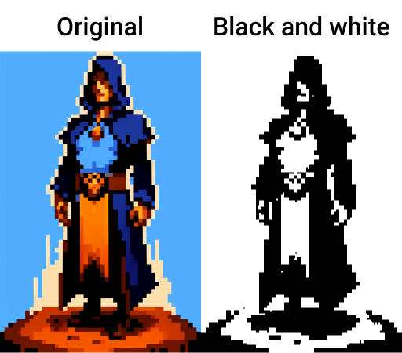
  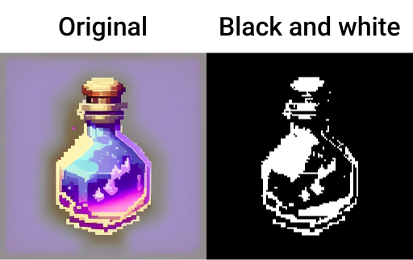
  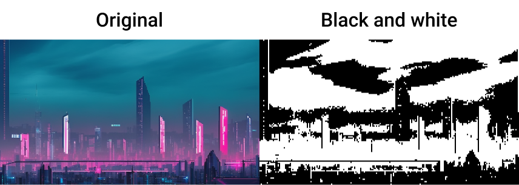

### Custom color palette
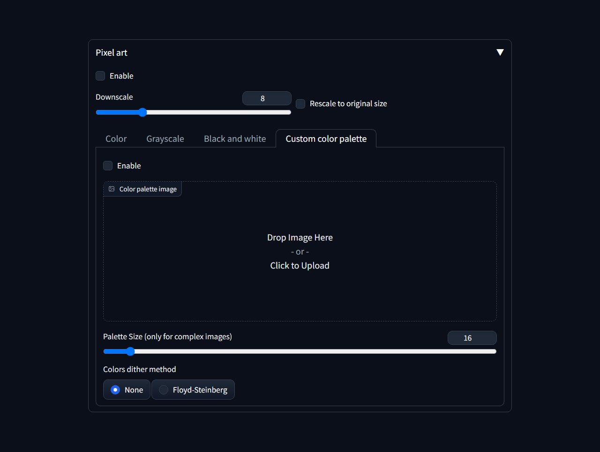
This mode allows to paint image with colors from another image. If palette included in image, like palettes from [lospec]([url](https://lospec.com/palette-list)), script will automatically apply it, overwise you can select palette size manually with **Palette Size (only for complex images)** slider.

https://github.com/mrreplicart/sd-webui-pixelart/assets/137555918/2ab3be33-3229-4eeb-8d01-65c231398e0d

  
Custom palette examples

  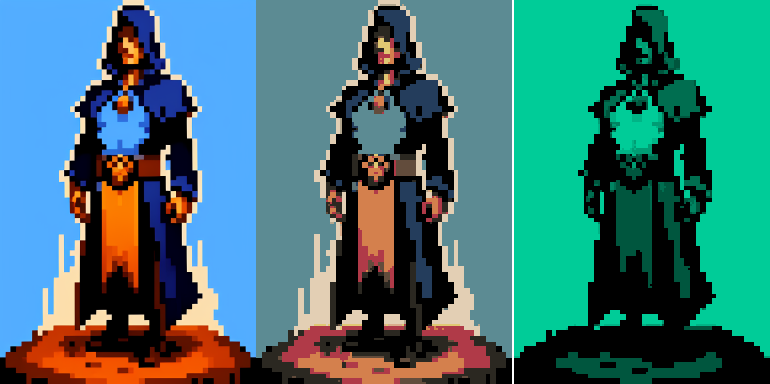
  
  

